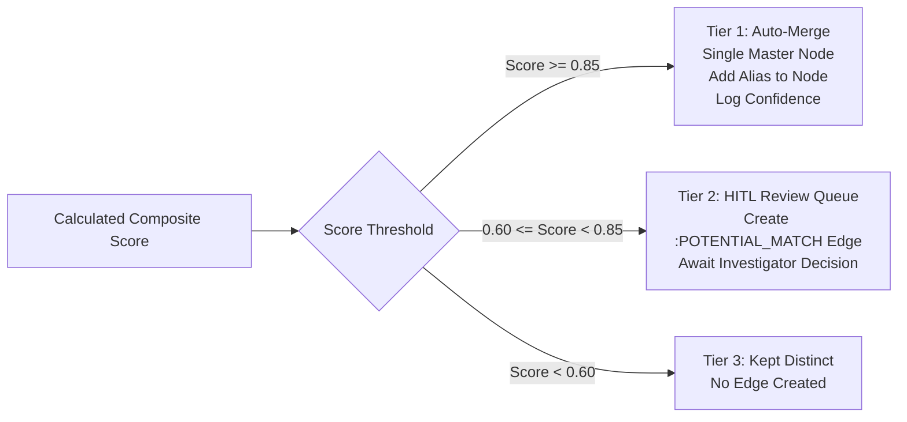

# 📄 PRODUCT REQUIREMENTS DOCUMENT (PRD)
# NetSentry: Autonomous Criminal Network & Cross-Jurisdiction Intelligence Platform

---

## Document Control

| Property | Value |
|:---|:---|
| **Document Version** | `1.0.0-PRODUCTION-SPEC` |
| **System Classification** | Law Enforcement Intelligence & Network Graph Analytics |
| **Target Operating Environments** | Air-gapped on-premise workstations, secure departmental private clouds |
| **Status** | Approved for Implementation |
| **Architecture Paradigm** | Micro-modular Monolith (FastAPI + Neo4j + React/Vite) |

---

## 1. Executive Summary & Vision

### 1.1 Problem Statement
Modern law enforcement agencies (LEAs) in fragmented administrative jurisdictions face systemic barriers in detecting inter-state criminal syndicates:
1. **Jurisdictional Silos:** Police records (e.g., state CCTNS systems, Cyber Crime cells, State Special Task Forces) are isolated in disparate databases with mismatched schemas and no shared national primary keys.
2. **Identity Entropy & Aliasing:** Criminal actors deliberately obscure their identities using regional spelling permutations, dialectal phonetic shifts, aliases, and bilingual records (e.g., *"Mohd. Aslam"*, *"Md Aslam"*, *"Aslam Bhai"*, *"अस्लम"*). Traditional exact-match relational databases treat these as distinct individuals, fragmenting network visibility.
3. **Multi-Hop Obfuscation:** Masterminds and kingpins insulate themselves behind multiple hops of communication intermediaries, burner SIM cards, and mule bank accounts.
4. **Analyst Bottlenecks:** Investigating Officers (IOs) manually cross-reference paper FIRs, telco CDR (Call Detail Records) dumps, and bank statements—a process requiring weeks that often yields cold leads.

### 1.2 System Vision
**NetSentry** is an autonomous, explainable criminal network intelligence platform designed to ingest multi-source, multi-department unstructured and structured records, resolve fragmented identities via a localized phonetic-fuzzy resolution engine, link entities across state jurisdictions, construct a multi-relational knowledge graph in Neo4j, and surface key network orchestrators using graph data science and explainable risk modeling.

### 1.3 Core Architectural Principles
- **100% Sovereign & Air-Gapped:** Zero dependency on external paid proprietary APIs (e.g., OpenAI, Claude). All NLP, similarity scoring, and graph algorithms run on local hardware.
- **Human-in-the-Loop (HITL):** Deterministic confidence triage ensures algorithms surface leads and candidate merges, but the investigating officer retains final adjudicative control.
- **White-Box Explainability:** Every anomaly flag, risk score, and identity link is paired with a deterministic, plain-English legal justification.
- **Schema-Agnostic Ingestion:** Adaptable to any departmental database schema through declarative YAML/JSON data mappings.

---

## 2. System Architecture & High-Level Topology

```
┌───────────────────────────────────────────────────────────────────────────────────────────────────────┐
│                                           DATA INGESTION                                              │
│   ┌─────────────────────┐    ┌─────────────────────┐    ┌──────────────────┐    ┌─────────────────┐   │
│   │ State Police FIRs   │    │ Inter-state Crime DB│    │ Telco CDR Dumps  │    │ Bank Txn Logs   │   │
│   │ (CSV / JSON / Text) │    │ (CSV / JSON)        │    │ (CSV / TSV)      │    │ (CSV / Excel)   │   │
│   └──────────┬──────────┘    └──────────┬──────────┘    └────────┬─────────┘    └────────┬────────┘   │
└──────────────┼──────────────────────────┼────────────────────────┼───────────────────────┼────────────┘
               ▼                          ▼                        ▼                       ▼
┌───────────────────────────────────────────────────────────────────────────────────────────────────────┐
│                                     NORMALIZATION & EXTRACTION                                        │
│   ┌──────────────────────────────────────────────┐     ┌──────────────────────────────────────────┐   │
│   │ Schema Adapters (Field Mapping Engine)       │     │ spaCy NER & Regex Pattern Extractor      │   │
│   │ Canonical Entity Normalization               │     │ Indian Names, Phones, Plates, Bank A/Cs  │   │
│   └──────────────────────────────────────────────┘     └──────────────────────────────────────────┘   │
└───────────────────────────────────────────────────┬───────────────────────────────────────────────────┘
                                                    ▼
┌───────────────────────────────────────────────────────────────────────────────────────────────────────┐
│                                 CORE ENGINE: IDENTITY & JURISDICTION                                  │
│   ┌──────────────────────────────────────────────┐     ┌──────────────────────────────────────────┐   │
│   │ USP 1: Indic Alias Resolution Engine         │     │ USP 2: Cross-Jurisdiction Entity Linker  │   │
│   │ RapidFuzz + Metaphone + Corroboration Matrix │     │ Multi-Agency Provenance & Graph Merging  │   │
│   └──────────────────────┬───────────────────────┘     └─────────────────────┬────────────────────┘   │
│                          │                                                   │                        │
│                          └───────────────────────┬───────────────────────────┘                        │
│                                                  ▼                                                    │
│                                   ┌─────────────────────────────┐                                     │
│                                   │ Confidence Triage:          │                                     │
│                                   │ Score >= 0.85 -> Auto-Merge │                                     │
│                                   │ 0.60 - 0.84   -> HITL Queue │                                     │
│                                   │ Score < 0.60  -> Separate   │                                     │
│                                   └──────────────┬──────────────┘                                     │
└──────────────────────────────────────────────────┼────────────────────────────────────────────────────┘
                                                   ▼
┌───────────────────────────────────────────────────────────────────────────────────────────────────────┐
│                                  GRAPH STORAGE & ANALYTICS LAYER                                      │
│   ┌──────────────────────────────────────────────┐     ┌──────────────────────────────────────────┐   │
│   │ Neo4j Knowledge Graph                        │     │ Graph Data Science (GDS) & Centrality    │   │
│   │ Multi-relational Cypher Ontology             │     │ Betweenness, Degree, PageRank, Louvain   │   │
│   ├──────────────────────────────────────────────┤     ├──────────────────────────────────────────┤   │
│   │ Scikit-Learn Anomaly Detection Engine        │     │ Deterministic Plain-English XAI          │   │
│   │ Multi-feature Isolation Forest               │     │ Legal Evidence Dossier Synthesizer       │   │
│   └──────────────────────────────────────────────┘     └──────────────────────────────────────────┘   │
└───────────────────────────────────────────────────┬───────────────────────────────────────────────────┘
                                                    ▼
┌───────────────────────────────────────────────────────────────────────────────────────────────────────┐
│                                         REST API LAYER                                                │
│                 FastAPI Micro-Framework • Pydantic V2 Schemas • Structured JSON Logs                  │
└───────────────────────────────────────────────────┬───────────────────────────────────────────────────┘
                                                    ▼
┌───────────────────────────────────────────────────────────────────────────────────────────────────────┐
│                                      PRESENTATION & UI LAYER                                          │
│   ┌──────────────────────────────────────────────┐     ┌──────────────────────────────────────────┐   │
│   │ Force-Directed 2D/3D Graph Visualizer        │     │ Interactive Dossier & Inspector Panel    │   │
│   │ Multi-jurisdiction Badges & Filters          │     │ Real-time Evidence Breakdown & Metrics   │   │
│   ├──────────────────────────────────────────────┤     ├──────────────────────────────────────────┤   │
│   │ Human-in-the-Loop Merge Review Queue         │     │ Audit Log & Investigation Export Engine  │   │
│   └──────────────────────────────────────────────┘     └──────────────────────────────────────────┘   │
└───────────────────────────────────────────────────────────────────────────────────────────────────────┘
```

---

## 3. Technology Stack & Component Selection

| Layer | Component / Tool | Version / Library | Architectural Justification |
|:---|:---|:---|:---|
| **Graph Database** | Neo4j Community / Aura | `5.x+` | Native property graph model, highly optimized Cypher engine for multi-hop traversals and sub-second pathfinding. |
| **Backend Framework** | FastAPI | `0.110+` | High-throughput asynchronous Python framework, native Pydantic V2 validation, automated OpenAPI docs. |
| **NLP & Entity Extraction**| spaCy | `en_core_web_sm / md` | Production-grade CPU-friendly Named Entity Recognition for unstructured FIR case summaries. |
| **Fuzzy Matching** | RapidFuzz | `3.6+` | C++-backed high performance Levenshtein and Token Sort Ratio computation for fuzzy names. |
| **Phonetic Matching** | Jellyfish / Metaphone | `1.0+` | Double Metaphone and Soundex encoding adapted to Indian regional phonetic variations. |
| **Transliteration** | Indic-Transliteration | `2.3+` | Script normalization between Devanagari / IAST / ISO 15919 to Latin Romanized spellings. |
| **Machine Learning** | Scikit-Learn | `1.4+` | Unsupervised Isolation Forest for structural network and transactional anomaly scoring. |
| **Frontend Framework** | React + Vite | `React 18 / Vite 5` | Fast compilation, lightweight single-page application architecture. |
| **Graph Visualization** | `react-force-graph-2d` / `3d` | Canvas / WebGL | Smooth force-directed simulation capable of rendering thousands of nodes and links with dynamic physics. |
| **CSS & Design System** | Tailwind CSS | `3.4+` | Rapid utility-first styling with sleek dark-mode intelligence command center aesthetics. |

---

## 4. Detailed Functional Specifications

### 4.1 Data Ingestion & Schema Normalization (FR-1)

#### 4.1.1 Canonical Entity Model
Every incoming record, regardless of source department, is transformed into a standardized internal representation:
```json
{
  "canonical_person": {
    "source_id": "string",
    "department_id": "string",
    "raw_name": "string",
    "normalized_name": "string",
    "phonetic_tokens": ["string"],
    "phone_numbers": ["string"],
    "vehicles": ["string"],
    "bank_accounts": ["string"],
    "addresses": ["string"],
    "fir_references": ["string"]
  }
}
```

#### 4.1.2 Declarative Schema Mapping Specification
Department-specific variations are managed using declarative mapping files (`config/schema_mappings.yaml`):
```yaml
departments:
  MH_POLICE:
    id_field: "fir_number"
    person_name_fields: ["accused_name", "suspect_name"]
    alias_field: "known_aliases"
    contact_fields: ["mobile_no", "contact_number"]
    vehicle_field: "vehicle_reg"
    narrative_field: "case_summary"
    date_field: "date_of_incident"

  KA_POLICE:
    id_field: "crime_no"
    person_name_fields: ["suspect_full_name"]
    alias_field: "alias_or_nickname"
    contact_fields: ["phone", "sim_card_msisdn"]
    vehicle_field: "rto_vehicle_number"
    narrative_field: "fir_brief"
    date_field: "registration_timestamp"

  FINANCIAL_INTEL:
    id_field: "transaction_id"
    person_name_fields: ["account_holder_name", "beneficiary_name"]
    account_field: "account_number"
    contact_fields: ["registered_phone"]
    amount_field: "amount_inr"
    timestamp_field: "transaction_time"
```

### 4.2 NLP & Unstructured Narrative Parsing (FR-2)
For raw text FIR summaries:
1. **Pre-processing:** Lowercasing, removing police administrative boilerplate ("complainant stated that...", "FIR lodged under section...").
2. **Named Entity Recognition (NER):** Extract `PERSON` (suspects, associates, victims), `GPE/LOC` (hideouts, border checkpoints, drop points), and `ORG` (gang syndicates, front companies).
3. **Deterministic Regex Extraction:**
   - **Indian Mobile Numbers:** `(?:(?:\+|0{0,2})91(\s*[\-]\s*)?|[0]?)?[6789]\d{9}`
   - **Indian Vehicle Plates:** `[A-Z]{2}[ -]?[0-9]{1,2}[ -]?[A-Z]{1,3}[ -]?[0-9]{4}`
   - **Bank Account / IFSC:** `^[A-Z]{4}0[A-Z0-9]{6}$` (IFSC pattern matching)

---

### 4.3 USP 1: Indic Alias & Identity Resolution Engine (FR-3)

#### 4.3.1 Mathematical Scoring Formulation
The similarity between two suspect candidate records $A$ and $B$ is calculated as a multi-tier weighted composite score:

$$\text{Similarity}(A, B) = w_{\text{fuzzy}} \cdot S_{\text{fuzzy}} + w_{\text{phonetic}} \cdot S_{\text{phonetic}} + w_{\text{token}} \cdot S_{\text{token}} + S_{\text{corroboration}}$$

Where weights satisfy $w_{\text{fuzzy}} + w_{\text{phonetic}} + w_{\text{token}} = 1.0$, with calibrated default values:
- $w_{\text{fuzzy}} = 0.35$
- $w_{\text{phonetic}} = 0.35$
- $w_{\text{token}} = 0.30$

#### 4.3.2 Metric Computation Rules
1. **Fuzzy Distance ($S_{\text{fuzzy}}$):**
   $$S_{\text{fuzzy}} = \frac{\text{LevenshteinSimilarity}(\text{Name}_A, \text{Name}_B)}{100}$$
2. **Phonetic Distance ($S_{\text{phonetic}}$):**
   Double Metaphone encoding applied to normalized tokens. If primary codes match, $S_{\text{phonetic}} = 1.0$. If secondary codes match, $S_{\text{phonetic}} = 0.8$.
3. **Token Sort / Set Ratio ($S_{\text{token}}$):**
   Handles token re-ordering common in Indian names (e.g., *"Aslam Mohammed"* vs *"Mohammed Aslam"*):
   $$S_{\text{token}} = \frac{\text{TokenSortRatio}(\text{Name}_A, \text{Name}_B)}{100}$$
4. **Corroborating Signal Matrix ($S_{\text{corroboration}}$):**
   Boosts confidence when auxiliary evidence aligns:
   - Shared verified phone number: $+0.40$
   - Shared vehicle registration: $+0.35$
   - Shared bank account: $+0.45$
   - Shared co-accused in independent FIR: $+0.20$
   - Shared location within 48-hour window: $+0.15$
   *(Composite score is capped at $1.00$)*

#### 4.3.3 Three-Tier Adjudication Pipeline


---

### 4.4 USP 2: Schema-Agnostic Cross-Jurisdiction Entity Linking (FR-4)

#### 4.4.1 Cross-Jurisdiction Resolution Pipeline
1. **Deterministic Hard-Key Join:** If Record $R_1$ from `Department_A` and Record $R_2$ from `Department_B` share an identical phone number, vehicle plate, or bank account, synthesize a direct cross-jurisdictional link.
2. **Fuzzy Identity Convergence:** If $R_1$ and $R_2$ achieve Tier 1 Auto-Merge through the Alias Engine, merge into a unified `:Person` node containing:
   - `originating_departments: ["MH_POLICE", "KA_POLICE"]`
   - `jurisdiction_count: 2`
   - `is_cross_jurisdiction: true`
3. **Visual & Analytical Flags:** Highlight inter-state bridges in the network topology using distinct border rings, jurisdiction badges, and elevated centrality weights.

---

## 5. Knowledge Graph & Database Specifications

### 5.1 Graph Ontology & Schema

#### 5.1.1 Node Labels and Properties
```cypher
// Person Node
(:Person {
  id: STRING,                     // Unique UUID: PER_<hex>
  canonical_name: STRING,         // Standard primary display name
  aliases: LIST<STRING>,          // Array of resolved alternative names
  risk_score: INTEGER,            // 0 - 100
  risk_tier: STRING,              // "CRITICAL" | "HIGH" | "MEDIUM" | "LOW"
  betweenness_centrality: FLOAT,  // Calculated betweenness metric
  degree_centrality: INTEGER,     // Direct degree connectivity
  originating_departments: LIST<STRING>, // e.g. ["MH_POLICE", "KA_POLICE"]
  jurisdiction_count: INTEGER,    // Number of distinct departments
  is_cross_jurisdiction: BOOLEAN, // True if count > 1
  created_at: DATETIME,
  updated_at: DATETIME
})

// Phone Node
(:Phone {
  number: STRING,                 // Primary key: E.164 or normalized 10-digit
  carrier: STRING,
  first_seen: DATETIME,
  last_seen: DATETIME,
  is_suspicious_imei: BOOLEAN
})

// Vehicle Node
(:Vehicle {
  registration_no: STRING,        // Primary key: e.g. "MH04AB1234"
  model: STRING,
  color: STRING,
  rto_state: STRING
})

// BankAccount Node
(:BankAccount {
  account_number: STRING,         // Primary key
  bank_name: STRING,
  ifsc_code: STRING,
  total_throughput: FLOAT
})

// FIR Node
(:FIR {
  fir_id: STRING,                 // Primary key: e.g. "FIR_MH_2024_402"
  fir_number: STRING,
  police_station: STRING,
  state: STRING,
  ipc_sections: LIST<STRING>,
  incident_date: DATE,
  summary: STRING
})

// Department Node
(:Department {
  dept_id: STRING,                // Primary key: e.g. "MH_POLICE"
  name: STRING,
  state: STRING,
  jurisdiction_type: STRING
})
```

#### 5.1.2 Relationship Types and Properties
```cypher
// Relationships
(:Person)-[:USES]->(:Phone)
(:Person)-[:OWNS]->(:Vehicle)
(:Person)-[:OPERATES]->(:BankAccount)
(:Person)-[:SUSPECT_IN]->(:FIR)
(:FIR)-[:FILED_AT]->(:Department)

(:Person)-[:COMMUNICATED_WITH {
  call_count: INTEGER,
  total_duration_secs: INTEGER,
  first_call: DATETIME,
  last_call: DATETIME
}]->(:Person)

(:Person)-[:TRANSACTED_WITH {
  total_amount: FLOAT,
  transaction_count: INTEGER,
  flagged_velocity: BOOLEAN
}]->(:Person)

(:Person)-[:ASSOCIATE_OF {
  evidence_type: STRING,          // "CO_ACCUSED" | "CALL_OVERLAP" | "FINANCIAL"
  confidence: FLOAT
}]->(:Person)

(:Person)-[:POTENTIAL_MATCH {
  resolution_id: STRING,
  confidence_score: FLOAT,
  match_reasons: LIST<STRING>,
  created_at: DATETIME
}]->(:Person)
```

#### 5.1.3 Neo4j Constraints & Indexes
```cypher
CREATE CONSTRAINT unique_person_id IF NOT EXISTS FOR (p:Person) REQUIRE p.id IS UNIQUE;
CREATE CONSTRAINT unique_phone_number IF NOT EXISTS FOR (ph:Phone) REQUIRE ph.number IS UNIQUE;
CREATE CONSTRAINT unique_vehicle_reg IF NOT EXISTS FOR (v:Vehicle) REQUIRE v.registration_no IS UNIQUE;
CREATE CONSTRAINT unique_bank_acc IF NOT EXISTS FOR (b:BankAccount) REQUIRE b.account_number IS UNIQUE;
CREATE CONSTRAINT unique_fir_id IF NOT EXISTS FOR (f:FIR) REQUIRE f.fir_id IS UNIQUE;

CREATE INDEX person_canonical_name IF NOT EXISTS FOR (p:Person) ON (p.canonical_name);
CREATE INDEX person_risk_score IF NOT EXISTS FOR (p:Person) ON (p.risk_score);
CREATE INDEX person_cross_jur IF NOT EXISTS FOR (p:Person) ON (p.is_cross_jurisdiction);
```

---

## 6. Graph Analytics, Centrality & Explainable AI (FR-6 & FR-7)

### 6.1 Centrality Metrics & Kingpin Detection
Centrality is computed using the Neo4j Graph Data Science (GDS) library or local NetworkX fallback:

1. **Betweenness Centrality ($C_B$):**
   Identifies covert brokers who bridge disparate clusters (e.g., local state gangs and inter-state suppliers):
   $$C_B(v) = \sum_{s \neq v \neq t} \frac{\sigma_{st}(v)}{\sigma_{st}}$$
   Nodes in the 90th percentile of $C_B$ with moderate direct connections are flagged as **Covert Facilitators / Syndicate Liaisons**.

2. **Degree Centrality ($C_D$):**
   Identifies operational commanders who maintain dense direct communications with foot soldiers.

3. **PageRank ($PR$):**
   Measures recursive influence propagation across the transaction and communication graph.

### 6.2 Anomaly Detection (Isolation Forest)
Feature vector constructed per suspect node $v$:
$$\mathbf{x}_v = \left[ C_B(v), C_D(v), PR(v), N_{\text{phones}}(v), N_{\text{jurisdictions}}(v), V_{\text{txns}}(v), \Delta t_{\text{burst}}(v) \right]$$
- Model: `sklearn.ensemble.IsolationForest(contamination=0.08, random_state=42)`
- Normalization: Scores scaled to $0 - 100$.

### 6.3 Explainable AI (XAI) Plain-English Synthesis Engine
Every flagged entity receives an automated, deterministic legal justification generated via rule-template synthesis:

```python
def generate_plain_english_explanation(entity: dict) -> str:
    reasons = []
    
    # 1. Centrality rationale
    if entity["betweenness_percentile"] >= 90:
        reasons.append(
            f"Acts as a critical communication bridge (Top {100 - entity['betweenness_percentile']}% "
            f"Betweenness Centrality) connecting {entity['bridged_clusters'][0]} and {entity['bridged_clusters'][1]}."
        )
    elif entity["degree"] >= 15:
        reasons.append(f"Functions as an operational hub with {entity['degree']} direct contacts.")

    # 2. Cross-jurisdiction rationale
    if entity["jurisdiction_count"] > 1:
        depts = ", ".join(entity["originating_departments"])
        reasons.append(
            f"Active across {entity['jurisdiction_count']} distinct police jurisdictions ({depts}) "
            f"with independent FIR records."
        )

    # 3. Identity and Alias corroboration
    if len(entity["aliases"]) > 1:
        alias_str = ", ".join([f"'{a}'" for a in entity["aliases"][1:]])
        reasons.append(
            f"Resolved across records using {len(entity['aliases']) - 1} known aliases ({alias_str}) "
            f"with {int(entity['resolution_confidence'] * 100)}% identity match confidence."
        )

    # 4. Multi-device / financial anomaly
    if entity["phone_count"] >= 3:
        reasons.append(f"Maintains {entity['phone_count']} distinct phone numbers within a 30-day window.")

    return f"Flagged as {entity['risk_tier']} RISK (Score: {entity['risk_score']}/100) because: " + " ".join(
        [f"({i+1}) {r}" for i, r in enumerate(reasons)]
    )
```

---

## 7. REST API Specifications (FastAPI)

Base Route: `/api/v1`

### 7.1 Data Contracts (Pydantic Models)

```python
from pydantic import BaseModel, Field
from typing import List, Optional, Dict, Any

class IngestRecordRequest(BaseModel):
    department_id: str = Field(..., example="MH_POLICE")
    dataset_type: str = Field(..., example="FIR_RECORDS")
    records: List[Dict[str, Any]]

class IngestRecordResponse(BaseModel):
    status: str
    records_processed: int
    entities_auto_merged: int
    pending_hitl_reviews: int

class GraphNode(BaseModel):
    id: str
    label: str
    type: str
    risk_score: int
    risk_tier: str
    aliases: List[str]
    departments: List[str]
    is_cross_jurisdiction: bool
    centrality_betweenness: float

class GraphLink(BaseModel):
    source: str
    target: str
    relationship: str
    properties: Dict[str, Any]

class GraphResponse(BaseModel):
    nodes: List[GraphNode]
    links: List[GraphLink]
    stats: Dict[str, int]

class EntityDetailResponse(BaseModel):
    id: str
    canonical_name: str
    aliases: List[str]
    risk_score: int
    risk_tier: str
    explanation: str
    jurisdictions: List[str]
    associated_firs: List[Dict[str, Any]]
    associated_identifiers: Dict[str, List[str]]
    direct_connections_count: int

class PendingResolutionItem(BaseModel):
    resolution_id: str
    entity_a: Dict[str, Any]
    entity_b: Dict[str, Any]
    confidence_score: float
    match_breakdown: Dict[str, Any]

class ResolutionDecisionRequest(BaseModel):
    resolution_id: str
    decision: str = Field(..., regex="^(MERGE|REJECT)$")
    reviewer_notes: Optional[str] = None
```

### 7.2 API Endpoint Catalog

| Method | Endpoint | Description | Query / Body Params | Response Code |
|:---|:---|:---|:---|:---:|
| `POST` | `/api/v1/ingest/batch` | Ingest and process departmental records | Body: `IngestRecordRequest` | `200 OK` |
| `GET` | `/api/v1/graph` | Fetch graph nodes & links for rendering | `focus_id` (str), `depth` (int), `min_risk` (int), `dept` (str) | `200 OK` |
| `GET` | `/api/v1/entities/{id}` | Detailed entity dossier and XAI explanation | Path: `id` | `200 OK` / `404` |
| `GET` | `/api/v1/resolve/pending` | Fetch pending HITL alias merge reviews | None | `200 OK` |
| `POST` | `/api/v1/resolve/decision` | Submit manual approve/reject merge decision | Body: `ResolutionDecisionRequest` | `200 OK` |
| `GET` | `/api/v1/analytics/centrality` | Run or retrieve latest centrality rankings | `limit` (int, default=20) | `200 OK` |
| `GET` | `/api/v1/dossier/{id}/export` | Export formatted printable dossier (JSON/PDF) | Path: `id` | `200 OK` |
| `GET` | `/api/v1/health` | Service health status and DB connectivity check | None | `200 OK` |

---

## 8. Frontend UI/UX Specifications

### 8.1 Layout Architecture
The NetSentry interface is an operational command dashboard partitioned into four key viewport components:

```
┌──────────────────────────────────────────────────────────────────────────────────────────────────┐
│                                       GLOBAL HEADER & FILTER BAR                                 │
│  [Logo: NetSentry]  [Search Suspect/Phone/FIR/Plate]  [Risk Filter: All/Crit]  [Dept: All/MH/KA] │
├──────────────────────────────────────────────────────────────────┬───────────────────────────────┤
│                                                                  │                               │
│                                                                  │   SLIDING INSPECTOR DRAWER    │
│                                                                  │   ------------------------    │
│                                                                  │   [Suspect Profile Header]    │
│                                                                  │   Name: Mohammed Aslam        │
│                                                                  │   Risk Meter: [92/100] (CRIT) │
│                                                                  │                               │
│                      FORCE-DIRECTED NETWORK GRAPH                │   [Cross-Jurisdiction Badges] │
│                      (Canvas / WebGL Renderer)                   │   [MH_POLICE]  [KA_POLICE]    │
│                                                                  │                               │
│                      - Node Size: Centrality                     │   [Plain-English XAI Summary] │
│                      - Node Color: Risk Tier                     │   "Acts as critical bridge..."│
│                      - Halo: Cross-Jurisdiction                  │                               │
│                      - Edge Label: Call Count / Amount           │   [Resolved Aliases List]     │
│                                                                  │   - Mohd. Aslam               │
│                                                                  │   - Aslam Bhai (KA)           │
│                                                                  │                               │
│                                                                  │   [Associated FIRs & CDRs]    │
│                                                                  │   [Export Evidence Dossier]   │
├──────────────────────────────────────────────────────────────────┴───────────────────────────────┤
│                     BOTTOM DOCK: HITL CANDIDATE REVIEW QUEUE (3 PENDING MERGES)                  │
└──────────────────────────────────────────────────────────────────────────────────────────────────┘
```

### 8.2 Design Tokens & Theme Specification
- **Color Palette:**
  - Background: Deep Obsidian (`#0B0F19`), Panel Surface (`#111827`), Card Border (`#1F2937`)
  - Risk Critical: Crimson Red (`#EF4444`)
  - Risk High: Amber Orange (`#F59E0B`)
  - Risk Medium: Cyan Blue (`#06B6D4`)
  - Risk Low: Emerald Green (`#10B981`)
  - Cross-Jurisdiction Badge: Royal Purple (`#8B5CF6`)
- **Typography:**
  - Primary UI: `Inter`, sans-serif
  - Telemetry & Data Identifiers: `JetBrains Mono`, monospace

### 8.3 Interaction Specifications
1. **Node Click:** Smooth camera zoom-to-fit on the selected node and its 1-hop neighborhood. Dims unrelated background nodes to 15% opacity. Opens the right-side Sliding Inspector Drawer within $\le 100\text{ ms}$.
2. **Edge Click:** Highlights the link and surfaces a modal showing underlying transactional records (call logs, timestamps, monetary transfers).
3. **HITL Review Workflow:**
   - Review drawer displays candidate $A$ and candidate $B$ side-by-side with highlighting on identical attributes (e.g. matching phone numbers).
   - "Confirm Merge" initiates an immediate atomic mutation in Neo4j, updating the graph in real-time with an animated node collapse transition.
   - "Reject Match" removes the pending item and records the rejection in the audit trail.

---

## 9. Synthetic Benchmark Dataset Design

To validate the system under realistic operational conditions without violating data privacy laws or using restricted LEA data, a multi-department synthetic dataset is generated with intentionally embedded inter-state criminal rings.

### 9.1 Dataset Blueprint: "The Deccan-Konkan Syndicate"

| Department / Silo | Synthetic File Format | Records Count | Planted Entities & Ring Role |
|:---|:---|:---:|:---|
| **Dept A: Maharashtra Police** | `mh_firs.csv` | 150 FIRs | • "Mohd. Aslam" (Kingpin / Supply Coordinator)<br>• "Shoaib Shooter" (Local Enforcer)<br>• Phone: `+91-9876543210`<br>• Vehicle: `MH-04-AB-1234` |
| **Dept B: Karnataka Police** | `ka_crime_records.json` | 120 Cases | • "Aslam Bhai" (Interstate Receiver / Hawala Liaison)<br>• "Kiran Bangalore" (Mule Account Holder)<br>• Phone: `+91-9876543210` (Identical SIM)<br>• Vehicle: `MH-04-AB-1234` |
| **Dept C: Financial Intelligence** | `fiu_transactions.csv` | 500 Txns | • Account: `HDFC_9920192831`<br>• Rapid burst transfers ($INR\ 45,00,000$) split across 8 border mule accounts within 48 hours |
| **Background Noise** | `telco_cdr_noise.csv` | 2,000 Calls | Randomized benign citizen communications generated via Python `Faker` to test false-positive resistance |

### 9.2 Verification Scenarios
1. **Scenario 1 (Direct Hard-Key Match):** System immediately merges records from Dept A and Dept B that share phone number `+91-9876543210` without human intervention.
2. **Scenario 2 (Phonetic & Dialectal Alias):** System matches *"Mohd. Aslam"* with *"अस्लम भाई"* (Aslam Bhai) using Indic transliteration and Double Metaphone, generating a 91% match confidence.
3. **Scenario 3 (Covert Broker / High Betweenness):** The Kingpin has no active FIRs filed in Karnataka, but betweenness centrality ranking highlights him in the top 1% of the entire network graph because he constitutes the sole path between Mumbai arms suppliers and Bangalore Hawala accounts.
4. **Scenario 4 (Borderline HITL Triage):** Candidate records *"Mohd. Iqbal"* and *"Iqbal Painter"* share an associate contact but differ in phone numbers (Score: 74%). The system queues them in the HITL review panel for manual review.

---

## 10. Non-Functional Requirements (NFR)

| Metric | Target Specification | Validation Method |
|:---|:---|:---|
| **Query Latency** | Subgraph fetch $\le 500\text{ ms}$ for 10,000 nodes and 50,000 edges | Automated benchmark using `pytest-benchmark` and Apache Bench |
| **Ingestion Throughput** | $\ge 1,000$ raw records processed and indexed per second | Batch ingestion load script profiling |
| **Alias Match Accuracy** | $\ge 88\%$ True Positive Rate, $\le 3\%$ False Positive Rate | Ground-truth synthetic evaluation benchmark |
| **Air-Gap Capability** | Zero outbound internet calls required during runtime | Execution verified in network-isolated Docker container |
| **Crash Resilience** | Zero unhandled exceptions; 100% error-state UI coverage | Chaos testing with malformed JSON and null payload injections |
| **Data Integrity** | ACID transactional compliance on all node merge/unmerge actions | Neo4j explicit transaction management with rollback on error |

---

## 11. Security, Privacy & Audit Governance

1. **Role-Based Access Control (RBAC):**
   - `Analyst`: Full read access, runs graph algorithms, submits merge proposals.
   - `Supervisory Officer`: Full read/write access, approves HITL candidate merges, exports court evidence dossiers.
   - `System Admin`: Manages schema mapping configurations, runs bulk ingest pipelines.
2. **Comprehensive Audit Trail:** Every query, search term, node merge, and unmerge action is written to an immutable log file (`logs/audit_trail.log`) recording timestamp, user ID, target entity, and decision justification.
3. **PII Masking Toggle:** UI includes a toggleable "Redaction Mode" that masks the middle digits of phone numbers (`+91-98765-XXXXX`) and bank accounts for demonstrations or unclassified briefings.

---

## 12. Quality Assurance & Test Verification Matrix

```
┌─────────────────────────────────────────────────────────────────────────────────────────────┐
│                                 AUTOMATED TEST MATRIX                                       │
├─────────┬──────────────────┬───────────────────────────────────────┬──────────────┬─────────┤
│ Test ID │ Target Module    │ Test Scenario                         │ Pass Criteria│ Type    │
├─────────┼──────────────────┼───────────────────────────────────────┼──────────────┼─────────┤
│ TC-001  │ Alias Engine     │ "Mohd. Aslam" vs "Md. Aslam" + Phone  │ Score >= 0.90│ Unit    │
│ TC-002  │ Alias Engine     │ "Aslam Bhai" vs "Mohd. Aslam" alone   │ 0.60 <= S <85│ Unit    │
│ TC-003  │ Alias Engine     │ "Rajesh Kumar" vs "Rakesh Kumar"      │ Score < 0.50 │ Unit    │
│ TC-004  │ Indic Matcher    │ "अस्लम" vs "Aslam" transliteration    │ Score >= 0.88│ Unit    │
│ TC-005  │ Cross-Dept Link  │ Ingest Dept A & Dept B with Plate     │ Badged Node  │ Integr. │
│ TC-006  │ Graph GDS        │ Network with planted broker node      │ Top 1% BC    │ System  │
│ TC-007  │ Explainability   │ Request dossier on Kingpin            │ 100% covered │ System  │
│ TC-008  │ API Contract     │ Schema validation on `/api/v1/graph`  │ Pydantic Pass│ Integr. │
│ TC-009  │ UI Resilience    │ Submit empty string / malformed JSON  │ Graceful Err │ E2E/UI  │
│ TC-010  │ Air-gap Test     │ Disconnect Wi-Fi; run complete app    │ Zero Failures│ E2E     │
└─────────┴──────────────────┴───────────────────────────────────────┴──────────────┴─────────┘
```

---

## 13. Deployment & Local Air-Gapped Setup

### 13.1 Directory Structure
```
netsentry/
├── backend/
│   ├── app/
│   │   ├── api/
│   │   │   ├── endpoints/
│   │   │   │   ├── graph.py
│   │   │   │   ├── entities.py
│   │   │   │   ├── ingestion.py
│   │   │   │   └── resolution.py
│   │   │   └── api_router.py
│   │   ├── core/
│   │   │   ├── config.py
│   │   │   └── security.py
│   │   ├── models/
│   │   │   ├── pydantic_schemas.py
│   │   │   └── graph_ontology.py
│   │   ├── services/
│   │   │   ├── alias_engine.py
│   │   │   ├── cross_jurisdiction.py
│   │   │   ├── neo4j_service.py
│   │   │   ├── ner_extractor.py
│   │   │   └── xai_explainer.py
│   │   └── main.py
│   ├── tests/
│   │   ├── test_alias_resolution.py
│   │   ├── test_cross_jurisdiction.py
│   │   └── test_graph_endpoints.py
│   ├── requirements.txt
│   └── Dockerfile
├── frontend/
│   ├── src/
│   │   ├── components/
│   │   │   ├── ForceGraphView.jsx
│   │   │   ├── InspectorDrawer.jsx
│   │   │   ├── HITLReviewQueue.jsx
│   │   │   ├── FilterBar.jsx
│   │   │   └── DossierModal.jsx
│   │   ├── services/
│   │   │   └── api.js
│   │   ├── App.jsx
│   │   └── index.css
│   ├── package.json
│   ├── vite.config.js
│   └── tailwind.config.js
├── data/
│   ├── raw/
│   ├── synthetic_generator.py
│   └── schema_mappings.yaml
├── docker-compose.yml
└── README.md
```

### 13.2 Docker Compose Configuration (`docker-compose.yml`)
```yaml
version: '3.8'

services:
  neo4j:
    image: neo4j:5.18.0-community
    container_name: netsentry-neo4j
    environment:
      - NEO4J_AUTH=neo4j/NetSentry2026Secure
      - NEO4J_PLUGINS=["apoc", "graph-data-science"]
    ports:
      - "7474:7474"
      - "7687:7687"
    volumes:
      - neo4j_data:/data
    healthcheck:
      test: ["CMD-SHELL", "wget --spider http://localhost:7474 || exit 1"]
      interval: 10s
      timeout: 5s
      retries: 5

  backend:
    build: ./backend
    container_name: netsentry-backend
    environment:
      - NEO4J_URI=bolt://neo4j:7687
      - NEO4J_USER=neo4j
      - NEO4J_PASSWORD=NetSentry2026Secure
      - ENVIRONMENT=production
    ports:
      - "8000:8000"
    depends_on:
      neo4j:
        condition: service_healthy

  frontend:
    build: ./frontend
    container_name: netsentry-frontend
    ports:
      - "3000:80"
    depends_on:
      - backend

volumes:
  neo4j_data:
```

---

## 14. Implementation Roadmap by Engineering Domain

### Phase 1: Foundation & Data Infrastructure
- [ ] Initialize Neo4j graph schema, constraints, and connection pooling.
- [ ] Implement declarative schema mapping parser (`schema_mappings.yaml`).
- [ ] Develop synthetic data generator (`synthetic_generator.py`) modeling multi-state criminal rings.

### Phase 2: AI/NLP & Resolution Engines
- [ ] Build `alias_engine.py` integrating RapidFuzz, Double Metaphone, and Indic transliteration.
- [ ] Build `cross_jurisdiction.py` resolving exact and fuzzy matches across departments.
- [ ] Implement `ner_extractor.py` using spaCy and Indian-specific regex extractors.

### Phase 3: Graph Analytics & REST APIs
- [ ] Implement Cypher data ingestion service in `neo4j_service.py`.
- [ ] Integrate GDS centrality algorithms (Betweenness, Degree, PageRank) and Scikit-learn anomaly scoring.
- [ ] Implement `xai_explainer.py` generating deterministic plain-English legal justifications.
- [ ] Expose all REST endpoints via FastAPI (`/graph`, `/entities/{id}`, `/resolve/pending`, `/resolve/decision`).

### Phase 4: Visualization & User Interface
- [ ] Scaffold React + Vite application with Tailwind CSS dark-mode intelligence command theme.
- [ ] Implement interactive force-directed 2D/3D graph component with node halo effects and edge inspection.
- [ ] Build Sliding Inspector Drawer displaying suspect profile, aliases, connections, and XAI text.
- [ ] Build Bottom Dock for Human-in-the-Loop merge review queue.
- [ ] Build Search & Filter bar with real-time graph filtering by department and risk tier.

### Phase 5: Hardening, Testing & Documentation
- [ ] Implement full unit and integration test suite across all modules.
- [ ] Verify complete system functionality in an air-gapped environment.
- [ ] Run stress and performance testing with 10,000+ nodes.
- [ ] Generate comprehensive API and user documentation.

---

<p align="center">
  <b>NetSentry Platform Architecture & Requirements Specification</b><br>
  <i>Confidential • For Engineering & Implementation Use Only</i>
</p>
