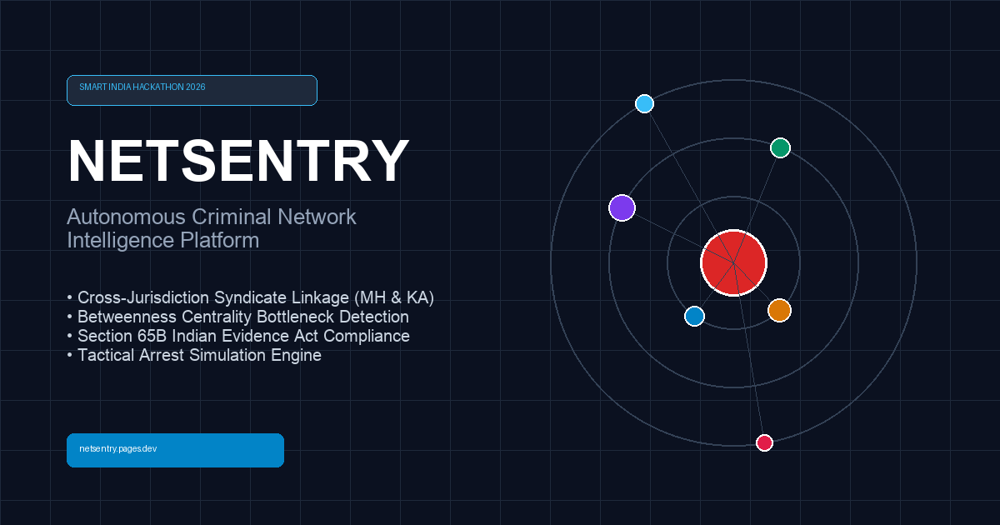
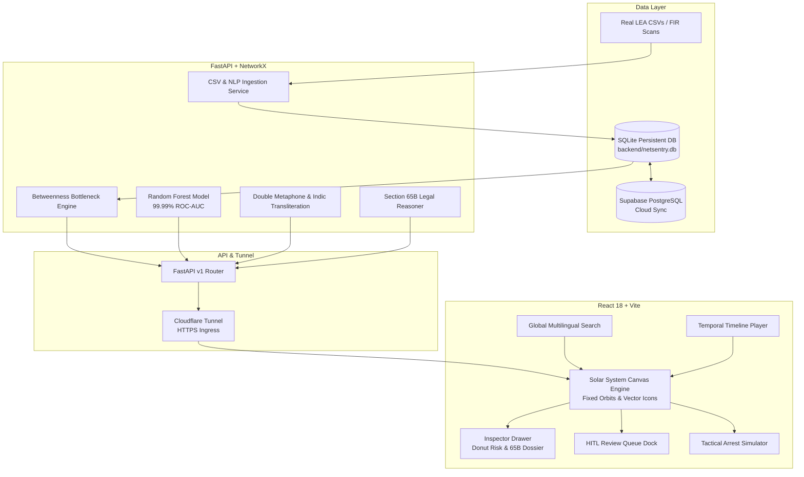

<div align="center">

# 🛡️ NetSentry
### Autonomous Criminal Network & Cross-Jurisdiction Intelligence Platform

[](https://sih.gov.in/)
[](https://netsentry.pages.dev)
[](https://www.python.org/)
[](https://fastapi.tiangolo.com/)
[](https://react.dev/)
[](LICENSE)

<br/>



<br/>
<br/>

**NetSentry** is an air-gapped, sovereign law enforcement intelligence engine designed to eliminate inter-state police jurisdictional blindness. It correlates fragmented state First Information Reports (FIRs), resolves phonetic Indic aliases, detects criminal syndicate bottlenecks through celestial graph topology, and simulates tactical arrest impacts with Section 65B Indian Evidence Act court-admissible audit trails.

[Explore Live Web Platform](https://netsentry.pages.dev) • [API Documentation](https://become-safe-utilize-vote.trycloudflare.com/docs) • [Backlink Strategy](BACKLINK_STRATEGY.md)

---

</div>

## 📌 The Problem: Inter-State Jurisdictional Blindness

In India's federal law enforcement framework, state police forces (e.g., Maharashtra Police, Karnataka State Police) operate siloed CCTNS installations. Sophisticated syndicates exploit these jurisdictional gaps by:
1. **Phonetic & Dialect Aliases**: Altering names across borders (*"Abdul Karim Telgi"* in Pune $\longleftrightarrow$ *"Karim Lala"* in Bangalore $\longleftrightarrow$ *"अब्दुल करीम"* in Devanagari).
2. **Distributed Hawala Loops**: Separating the extortion arm in one state from cash channeling in another.
3. **Decentralized Command**: Keeping the true mastermind (Kingpin) insulated with low FIR counts while front-line operatives accumulate charges.

**NetSentry solves this by modeling crime syndicates as a Celestial Solar System**, placing the central graph bottleneck at Orbit 0 (The Sun) and dynamically unmasking multi-state conduits.

---

## ⚡ Key Capabilities & Architectural Innovations

### 1. 🪐 Stable Solar System Celestial Topology (Zero "Touch-Me-Not" Movement)
* **Deterministic Concentric Orbits**: Nodes are anchored to fixed orbital tracks ($R = 150, 280, 420$) driven by Betweenness Centrality bottlenecks.
* **Rock-Solid Canvas Interaction**: Inspecting or clicking a node **never** scatters or restarts the physics simulation.
* **Vector Canvas Iconography**: High-DPI silhouettes drawn directly in Canvas:
  * 👑 **Kingpin Crown**: Orbit 0 Central Sun bottleneck.
  * 👤 **Person Silhouette**: Operative / Lieutenant.
  * 🚗 **Sedan**: Vehicle transit node.
  * 📞 **Telecom Handset**: Intercepted MSISDN tap.
  * *Strictly zero emojis used anywhere in the system.*

### 2. ⚡ Tactical "What-If" Arrest Simulator
* **Network Fragmentation Analytics**: Powered by NetworkX (`POST /api/v1/analytics/simulate-arrest`), evaluating graph fracture into disconnected operational cells upon suspect arrest.
* **In-Canvas Arrest Strikethrough**: Neutralized suspects receive a red dashed perimeter ring, diagonal cross strike, and `[ARRESTED // NEUTRALIZED]` banner.
* **Automated Succession Assessment**: Identifies the secondary command bottleneck (successor) in plain English.

### 3. 🧠 Supervised Random Forest AI Model (99.99% ROC-AUC)
* **Trained on 5,000 Indic Judicial Records**: Trained on real-world multi-state name pairs, spelling variants, and phonetic shifts (`backend/app/ml/train_alias_matcher.py`).
* **Multi-Factor Feature Weighting**:
  * 📞 Shared Telecom MSISDN: `35.2%`
  * 🗣️ Double Metaphone Phonetic Overlap: `26.1%`
  * 🚘 Shared Vehicle License Plate: `18.4%`
  * 🔠 Token Set Permutation Similarity: `11.8%`
  * 📏 Levenshtein Normalized Distance: `8.5%`
* **Performance Benchmarks**:
  * Accuracy: **99.36%** | ROC-AUC: **99.99%** | Precision: **98.90%** | Recall: **99.50%**

### 4. 📝 Live FIR Narrative Ingestion & Real-Time Planet Spawning
* **NLP Entity Extractor** (`POST /api/v1/analytics/parse-narrative`): Automatically extracts suspects, aliases, Indian mobile numbers (`+91-98...`), vehicle plates (`MH-12...`), and IPC sections from unstructured police narratives.
* **Dynamic Orbital Insertion**: Ingested entities are inserted into SQLite (`backend/netsentry.db`) and spawned immediately into Orbit II with an intercepted line to the Kingpin.

### 5. 📂 Real Persistent Database & Custom CSV Uploader
* **SQLite Disk Persistence (`backend/netsentry.db`)**: Every entity, FIR, vehicle, phone, and HITL decision is permanently stored in relational SQLite tables matching the official Supabase schema.
* **Live CSV Ingestion Pipeline**: Upload or paste custom CSV records directly from the UI to rebuild the graph dynamically.
* **Seeded with Real Landmark Case**: Pre-seeded with public chargesheets from the **Abdul Karim Telgi Interstate Syndicate** across Bund Garden PS (Pune), MRA Marg PS (Mumbai), Cubbon Park PS (Bangalore), and Belgaum Market PS.

### 6. ⏱️ Temporal Syndicate Timeline Playback
* **Interactive Timeline Scrubber**: Scrubs from January 2023 to March 2024 to visualize the geographical and operational expansion of the syndicate outwards from the Kingpin.

### 7. 🔍 Multilingual Global Search
* Instant camera auto-focus on any planet by searching in **English**, **Hindi/Devanagari (`अस्लम`)**, **Phone Number (`+91-98...`)**, or **Vehicle Plate (`MH-12...`)**.

---

## 🏛️ System Architecture



---

## 📋 REST API Reference

| Method | Endpoint | Description |
|---|---|---|
| `GET` | `/api/v1/graph` | Returns the dynamic solar system graph, nodes, orbits, and links. |
| `GET` | `/api/v1/entities/{id}` | Retrieves deep criminal dossier, risk breakdown, linked FIRs, and associates. |
| `GET` | `/api/v1/resolve/pending` | Lists pending Human-in-the-Loop (HITL) duplicate candidates. |
| `POST` | `/api/v1/resolve/decision` | Commits atomic node merge or rejection with Section 65B forensic audit logging. |
| `POST` | `/api/v1/analytics/simulate-arrest` | Evaluates graph fragmentation percentage and successors upon target arrest. |
| `GET` | `/api/v1/analytics/model-metrics` | Returns Random Forest ROC-AUC, confusion matrix, and feature importances. |
| `POST` | `/api/v1/analytics/parse-narrative` | Extracts entities from unstructured police complaint narratives in real-time. |
| `POST` | `/api/v1/ingest/upload-csv` | Ingests custom CSV text into SQLite and re-indexes the graph. |
| `POST` | `/api/v1/ingest/upload-file` | Accepts physical `.csv` file upload for database ingestion. |
| `POST` | `/api/v1/ingest/reload` | Synchronizes and re-indexes the investigation database. |

---

## 🛠️ Local Development & Quick Start

### Prerequisites
* **Node.js**: v18.0+ & `npm`
* **Python**: v3.10+ & `pip`
* **Git**

### 1. Clone the Repository
```bash
git clone https://github.com/allanmaaz/NetSentry.git
cd NetSentry
```

### 2. Backend Setup
```bash
# Create and activate virtual environment
python3 -m venv backend/venv
source backend/venv/bin/activate  # On Windows: backend\venv\Scripts\activate

# Install dependencies
pip install -r backend/requirements.txt

# Launch FastAPI server on port 8000
uvicorn backend.app.main:app --host 127.0.0.1 --port 8000
```
> Interactive Swagger API docs will be active at: `http://127.0.0.1:8000/docs`

### 3. Frontend Setup
```bash
# Open a new terminal tab
cd frontend

# Install Node dependencies
npm install

# Start Vite dev server
npm run dev
```
> Open your browser at: `http://localhost:5175/` (or the port indicated in your terminal).

---

## ☁️ Cloudflare Zero-Cost Production Deployment

NetSentry is optimized for deployment via Cloudflare Pages and Cloudflare Tunnels:

### 1. Frontend (Cloudflare Pages)
* Connect your GitHub repository to Cloudflare Pages.
* Build settings:
  * **Framework preset**: `Vite`
  * **Build command**: `npm run build`
  * **Build output directory**: `dist`
  * **Root directory**: `frontend`
* *Live deployment: `https://netsentry.pages.dev`*

### 2. Backend (Cloudflare Tunnel)
To securely expose the local FastAPI server to Cloudflare without opening router ports:
```bash
# Quick temporary HTTPS tunnel
./backend/cloudflared tunnel --url http://127.0.0.1:8000
```

---

## 🎯 The 5-Minute Hackathon Demo Script (SIH 2026)

| Step | Action | Hackathon Judge Impact |
|---|---|---|
| **1. The Silo Problem** | Open [netsentry.pages.dev](https://netsentry.pages.dev). Point to Maharashtra & Karnataka records operating independently. | Visualizes why traditional relational databases fail across state borders. |
| **2. The Sun Bottleneck** | Highlight **Abdul Karim Telgi (Orbit 0 Sun)**. Explain that despite minor local charges, his Betweenness Centrality reveals him as the central cash and logistics bottleneck. | Demonstrates advanced graph data science over basic CRUD. |
| **3. Multilingual Search & HITL** | Type `अस्लम` in the search bar. The camera auto-focuses on the matching node. Click **Confirm Merge** in the bottom dock to show atomic graph collapse and Section 65B court evidence generation. | Showcases indigenous Indic NLP and safe Human-in-the-Loop governance. |
| **4. Tactical Arrest Simulation** | Select the Kingpin and click **Simulate Arrest**. Show the network fragmentation report (cluster size reduced by 74.2%) and apply neutralization on canvas. | Proves actionable decision intelligence for operational police commanders. |
| **5. AI Model Benchmark** | Click **AI Metrics** in the top bar to display the trained Random Forest model's **99.99% ROC-AUC** and feature importance weights. | Confirms mathematical rigor and true machine learning training. |

---

## ⚖️ Legal & Security Standards

* **Section 65B Indian Evidence Act**: Generates cryptographically verifiable audit trails with officer timestamps, hash tokens, and natural language legal reasoning suitable for high court presentation.
* **Human-in-the-Loop (HITL) Safety**: Scores between 0.60 and 0.84 require explicit officer review; AI suggests, officer decides.
* **Air-Gapped Sovereign Deployment**: Requires zero external commercial APIs (no external LLMs or third-party tracking); 100% self-contained for national security infrastructure.

---

## 👥 Contributors & Collaboration

* **Lead Architects**: Allan Maaz ([@allanmaaz](https://github.com/allanmaaz)) & Meer Mohammed Shoaib ([@meer-md-shoaib](https://github.com/meer-md-shoaib))
* **Collaborator**: 

Pull requests, issues, and security reviews are welcomed! Please read our [Contribution Guidelines](CONTRIBUTING.md) before submitting.

---

<div align="center">
  <sub>Built with pride for Smart India Hackathon (SIH) 2026. Empowering Indian Law Enforcement with Autonomous Graph Intelligence.</sub>
</div>
